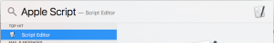
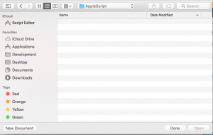
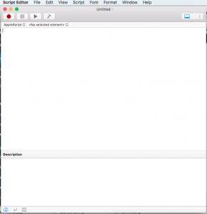
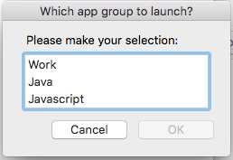

I work in more than one environment like Java, Javascript, Python and so on. So I open many different apps based on the environment that I work. For instance, if I work on Java, then I need my Intellij Idea IDE, Terminal and Browser to be opened. If in Javascript, I need Atom, Terminal and Browser. And in the morning, when I log in to machine, the very first thing that I do is, open Microsoft Outlook to check emails, open Skype to log-in, open Reminders to see any To-Dos for today and so on. I always wanted to group these and automate opening the needed apps based on the environment that I wanted to work on. The solution to this problem is Apple Script.

Mac comes with two different approaches to automate your frequent tasks:

- Apple Script
- Automator

In this post, I'll be covering `Apple script`. Please watch out for another post on Automator soon.

To open Apple Script, trigger your Spotlight and search for Apple script editor and hit Return. This will open up the apple script editor:



If you are on a El Captain, this would open a dialog on where to save the script:



Select New Document and you can see the editor opened:



Now we start writing our first Apple script.

```
-- Set my app groups
set workGroup to {"Microsoft Outlook", "Skype", "Reminders"}
set javaGroup to {"Intellij IDEA 15 CE", "Terminal"}
set javaScriptGroup to {"Atom", "Terminal", "Safari"}
set myAppGroups to {"Work", "Java", "Javascript"}
```

Above, we defined the different app group lists with list of applications for each group. At the end of the line, created a common list which will be shown to user to select.

```
-- Handler for launching selected app group
on appLauncher(selectedAppGroup)
repeat with i from 1 to (count of items in selectedAppGroup)
tell application (item i of selecteAppGroup)
activate
end tell
end repeat
end appLauncher
```

Now we created a method to launch the selected app group. We search for the item in the defined app group and tell our application to <b>activate</b> the apps defined in the selected app groups.

```
-- Let the user select the group
set mySelection to choose from list myAppGroups with title "Which app group to launch?"
```

The above is responsible to show the dialog to the user with the list of app groups defined (i.e., Work, Java and Javascript) and with the title <b>Which app group to launch?</b>.

```
-- If user cancels
if mySelection is false then
error number -128
else
set mySelection to item 1 of mySelection

-- If selection is Work
if mySelection = (item 1 of myAppGroups) then
appLauncher(workGroup)

-- If selection is Java
else if mySelection = (item 2 of myAppGroups) then
appLauncher(javaGroup)

-- If selection is java script
else if mySelection = (item 3 of myAppGroups) then
appLauncher(javaScriptGroup)

else
return
end if
end if
```

The above is the final makeup to our script. This block of code calls the app launcher handler with the selected app group by the user. Now the entire code look like:

```
-- Set my app groups
set workGroup to {"Microsoft Outlook", "Skype", "Reminders"}
set javaGroup to {"Intellij IDEA 15 CE", "Terminal"}
set javaScriptGroup to {"Atom", "Terminal", "Safari"}
set myAppGroups to {"Work", "Java", "Javascript"}

-- Handler for launching selected app group
on appLauncher(selectedAppGroup)
repeat with i from 1 to (count of items in selectedAppGroup)
tell application (item i of selecteAppGroup)
activate
end tell
end repeat
end appLauncher

-- Let the user select the group
set mySelection to choose from list myAppGroups with title "Which app group to launch?"

-- If user cancels
if mySelection is false then
error number -128
else
set mySelection to item 1 of mySelection

-- If selection is Work
if mySelection = (item 1 of myAppGroups) then
appLauncher(workGroup)

-- If selection is Java
else if mySelection = (item 2 of myAppGroups) then
appLauncher(javaGroup)

-- If selection is java script
else if mySelection = (item 3 of myAppGroups) then
appLauncher(javaScriptGroup)

else
return
end if
end if
```

Now click on the **Hammer** button in the editor or press Command + K to compile your code. If you don't have any syntax issues, the editor will automatically format and syntax highlight your script.

Then click on <b>Play</b> button to run your script, voila!!!



Now select the needed app group and enjoy. Save this script as '<b>LaunchAppGroup</b>'. The AppleScript saves the script as <b>.scpt</b> extension.

We have one more task left. Having a <b>.scpt</b> extension will not help us much. Because you can't just double-click to launch your application. Apple Script gives us export option to export our script as <b>.app</b> which can be used to launch our developed application. Click on <b>File > Export</b> and use the same name, but select <b>Application</b> from the <b>File Format</b> drop down. Also, check the <b>Run-only</b> checkbox.

Now you can double-click the app to launch our developed application. I would preferably keep this app in Desktop or Applications folder to easily accessible.
