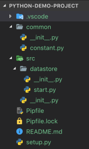

This post is the continuation of my previous post: [Python Package Management with Pipenv](../python-package-management-with-pipenv). I’ve package / dependency management in place, now I would like to setup the folder structure and get the scripts executed.

My problem statement is that I don’t have any main script which can call any modules to trigger. Time to time, I execute any scripts from any folder individually and I should not have any hard dependencies with any file. Let me show you an example which can easily explain my problem.

Consider the following folder structure I have in place now:

[](./python-demo-project-structure.png)

The `__init__.py` is the special file which helps python to treat the folders / files as module. For example, the `__init__.py` file in the `common/` directory makes it as a module, so that user can import this as a module anywhere. And the content of the `__init__.py` file is just empty.

The content of my `constant.py` is very simple:

```
ENDPOINT = "http://vimalselvam.com"
```

and the `start.py` in the `src/datastore/` directory:

```
import common.constant as constant

def run():
    print(constant.ENDPOINT)

if __name__ == " __main__":
    run()
```

Just by looking at the above code, you think there is no problem in executing, right? That was wrong. Let’s execute and see what’s happening:

```
~ pipenv run python src/datastore/start.py
Traceback (most recent call last):
  File "src/datastore/start.py", line 1, in <module>
    import common.constant as constant
ModuleNotFoundError: No module named 'common'
```

What happened! The problem is that Python doesn’t resolve the module dependencies if you execute the file which is not relative to the current directory. So you’ve to execute the `start.py` file as a module. Let’s do that:

```
~ pipenv run python -m src.datastore.start
http://vimalselvam.com
```

Gotcha! I’ve spent some time to figure this out and hence this as a post. If you found this useful, please like and share.
