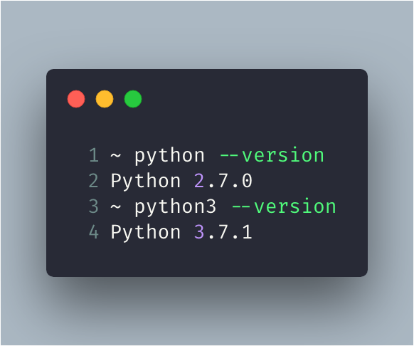

At my work I had to setup a package management for the Python based project. After almost 5 years, I'm putting my hands on Python and observed many things had changed. Especially, how we use the new Pipenv for managing python packages. Let's see on how to use Pipenv in Mac to setup the package management for the project.

Before starting, let me see what are the versions of python I've on my machine:



Surprise! I've two different versions installed on my machine. Fine, I wanted to use the `Python 3.7.1` version for my development.

```bash
hello
```

## Create the project

Let's create the project and setup the environment.

```bash
~ mkdir python-demo-project
~ cd python-demo-project
```

Install Pipenv first:

```bash
pip3 install pipenv
```

Setup pipenv environment to use **Python 3.x** version. Run the following from the current directory:

```bash
pipenv install --three
```

The above command will first create a virtual environment, then creates a **Pipfile** and then creates **Pipfile.lock**.

The Pipfile contains some useful information:

```
[[source]]
name = "pypi"
url = "https://pypi.org/simple"
verify_ssl = true

[dev-packages]

[packages]

[requires]
python_version = "3.7"
```

Important blocks are `dev-packages`, `packages` and `requires`. Any packages required for only development purpose, will be added under `dev-packages` and any other packages like for production use, those will be added under `packages`. The `requires` section tells you that minimum required version is `3.7`.

First, let’s install few packages for production use. To install a package with particular version.

```
pipenv install pandas==0.24.1
```

This will install the package and update the lockfile with dependencies details. The `packages` section in your **Pipfile** should look like this now:

```
[packages]
pandas = "==0.24.1"
```

Let’s install a package for development purpose.

```
pipenv install numpy==1.16.2 --dev
```

The above command will install **numpy** package in the `dev-packages` section.

To run any command using our virtual environment, we can simply use **pipenv** for it. For example, to open the `python3` shell, you can simply trigger the following command.

```
~ pipenv run python
Python 3.7.1 (default, Nov 6 2018, 18:46:03)
[Clang 10.0.0 (clang-1000.11.45.5)] on darwin
Type "help", "copyright", "credits" or "license" for more information.
>>>
```

Notice the version of python it shows.

Now I’ve the package management in place. In my future posts, I’ll share more about my learnings. Keep watching and don’t forget to hit like and share in case you found this useful.
