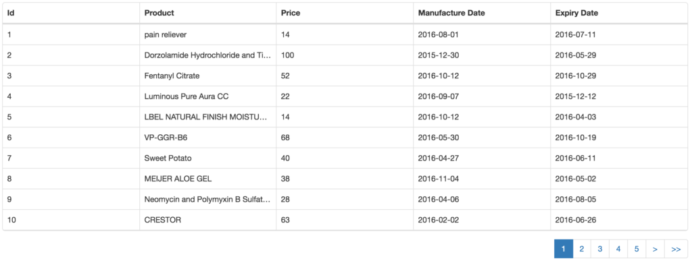

Sometime back I came across a library called [React Bootstrap Table](https://github.com/AllenFang/react-bootstrap-table). This helps you to build the table with loads of features like Pagination, Filtering, Sorting, Export to CSV and many more. And even it allows you to customise as per your need. I've explored various grid / table component libraries to use, but many came with difficulty to either learning or implementing or lack of expected feature. So I've got settled with this library and moreover it is actively maintained.

### What am I going to show?

- Basic table with data fetched from remote with pagination - Part 1
- Adding some filters - Part 2
- Customising few fields based on our needs - Part 3

### What not?

- I'm not going to show you how to write react app with redux. I assume that you should know react and redux already. If not, kindly head to this [tutorial](https://app.pluralsight.com/library/courses/react-redux-react-router-es6) written by [Cory House](https://medium.com/@housecor). Because the sample app created follows exactly the same structure what he taught in that tutorial.

### Demo

You can download the sample from [here](https://github.com/email2vimalraj/react-bootstrap-table-example/tree/basic-tutorial-part-1). This has the instructions on how to setup and run the demo.

### Mock Data

Before writing our component, we need some data to populate our table. I used [Mockaroo](http://mockaroo.com) to generate the mock data. The mock data contains **id, productName, price, manufacturedDate, expiryDate** elements with 100 rows. I would like to show 10 rows in table with 10 paginated links. This way at any point of time, user's browser will only have 10 rows of data. For every pagination navigation, there will be a fetch call triggered.

### Mock Api

To ease certain things, I use mock api instead of real api, which will return the data when queried. Create a file called **mockApi.js** in [**src/api/mockApi.js**](https://github.com/email2vimalraj/react-bootstrap-table-example/blob/basic-tutorial-part-1/src/api/mockApi.js).

```javascript
import _ from 'underscore'

// Mock data generated from https://www.mockaroo.com/
const mockData = [
  {
    id: 1,
    productName: 'pain reliever',
    price: 14,
    manufacturedDate: '2016-08-01',
    expiryDate: '2016-07-11'
  },
  {
    id: 2,
    productName: 'Dorzolamide Hydrochloride and Timolol Maleate',
    price: 100,
    manufacturedDate: '2015-12-30',
    expiryDate: '2016-05-29'
  }
]

class ProductApi {
  // Get the products by page number
  static getProducts(page) {
    return new Promise((resolve, reject) => {
      // Just to simulate a delay
      setTimeout(() => {
        let products = {}
        products.pageCount = 10
        products.resultsCount = 100
        products.productList = _.first(_.rest(mockData, page * 10 - 10), 10) // Divides the 100 data by chunks of 10
        resolve(Object.assign({}, products))
      }, 100)
    })
  }
}

export default ProductApi
```

The _getProducts_ method will be triggered by the redux action to fetch the data. Refer [src/actions/productActions.js](https://github.com/email2vimalraj/react-bootstrap-table-example/blob/basic-tutorial-part-1/src/actions/productActions.js) on how to trigger from action. We also need the data populated on the table once the page is landed. Refer [src/index.js](https://github.com/email2vimalraj/react-bootstrap-table-example/blob/basic-tutorial-part-1/src/index.js#L13) on how we dispatch an action. Using the redux reducer, we stored the data into the state called **products**. Let's create our component.

### Components

For this tutorial, I'm going to create 2 components:

1.  HomePage - A container component
2.  ProductList - A presentational component

Let's build our presentational component first.

#### ProductList

Create **ProductList.js** in [src/components/home/ProductList.js](https://github.com/email2vimalraj/react-bootstrap-table-example/blob/basic-tutorial-part-1/src/components/home/ProductList.js) and paste the following code:

```javascript
import React, { PropTypes } from 'react';
import { BootstrapTable, TableHeaderColumn } from 'react-bootstrap-table';

/**
A product list component which shows the table with list of data
**/
const ProductList = ({
  products,
  activePage,
  onNavigatePage
}) => {
  const productList = products.productList;

  const options = {
    hideSizePerPage: true,
    page: activePage,
    onPageChange: onNavigatePage
  };

  return(
    <bootstraptable data="{productList}" fetchinfo="{{dataTotalSize:" products.resultscount}}="" options="{options}" remote="" hover="" pagination=""><tableheadercolumn iskey="" datafield="id">Id</tableheadercolumn>
      <tableheadercolumn datafield="productName">Product</tableheadercolumn>
      <tableheadercolumn datafield="price">Price</tableheadercolumn>
      <tableheadercolumn datafield="manufacturedDate">Manufacture Date</tableheadercolumn>
      <tableheadercolumn datafield="expiryDate">Expiry Date</tableheadercolumn></bootstraptable>
  );
};

ProductList.propTypes = {
  products: PropTypes.object.isRequired,
  activePage: PropTypes.number.isRequired,
  onNavigatePage: PropTypes.func.isRequired
};

export default ProductList;
```

We start with importing _BootstrapTable_ and _TableHeaderColumn_ from _react-bootstrap-table_ library.
Then we initialize our _ProductList_ presentational component with three properties:

<ol>
	<li>_products_ - an object which we get from our mock api</li>
	<li>_activePage_ - the current page number</li>
	<li>_onNavigatePage_ - a function which will call our action (remember the action calls the mockApi) to update the data and updates the active page</li>
</ol>

In the return, we initiate the _BootstrapTable_ component with the required parameters which will be passed to our container component to render. Few things to note here:

<ol>
	<li>_data_ - takes the list of items to render in the table. In our case we are passing 10 items of product list</li>
	<li>_fetchInfo_ - in which we specify how much data we have, based on that the number of pages will be calculated. In our case, we are saying 100 rows, so the library will divide 100 by 10 by default and show 10 pages in the pagination links.</li>
	<li>_options_ - this is where we say what is our current page, what should happen if we navigate to another page and so on.</li>
	<li>_remote_ - when it is true, the library ensures the data is coming from external source. In our case, it is coming from _mockApi_.</li>
</ol>

Next thing, for each field we create a _TableHeaderColumn_ by saying my _id_ column is the unique using _isKey_ attribute.

Let's create our container component.

#### HomePage

Create _HomePage.js_ in [src/components/home/HomePage.js](https://github.com/email2vimalraj/react-bootstrap-table-example/blob/basic-tutorial-part-1/src/components/home/HomePage.js) and paste the following there:

```javascript
import React, { PropTypes } from 'react'
import { connect } from 'react-redux'
import { bindActionCreators } from 'redux'
import * as productActions from '../../actions/productActions'
import ProductList from './ProductList'

class HomePage extends React.Component {
  constructor(props, context) {
    super(props, context)
    this.state = {
      activePage: 1
    }
    this.onNavigatePage = this.onNavigatePage.bind(this)
  }

  // This calls the loadAllProducts action and
  // also updates the activePage state to the navigated page number
  onNavigatePage(page, sizePerPage) {
    this.props.actions.loadAllProducts(page)
    this.setState({ activePage: page })
  }

  render() {
    const { products } = this.props
    return (
      Object.keys(products).length > 0 && (
        <ProductList
          products={products}
          activePage={this.state.activePage}
          onNavigatePage={this.onNavigatePage}
        />
      )
    )
  }
}

HomePage.propTypes = {
  products: PropTypes.object.isRequired,
  actions: PropTypes.object.isRequired
}

function mapStateToProps(state, ownProps) {
  return {
    products: state.products
  }
}

function mapDispatchToProps(dispatch) {
  return {
    actions: bindActionCreators(productActions, dispatch)
  }
}

export default connect(mapStateToProps, mapDispatchToProps)(HomePage)
```

Direct jump to _render_ method. The _render_ method simply initiates a _ProductList_ component with the required properties which we have explained earlier.

The _onNavigatePage_ method is implemented here which takes care of calling the action for the required page and udpates the _activePage_ state so that the pagination control set the current page as active. That's it.

Now if you run _npm start -s_, and head to browser where it opened _<a href="http://localhost:3005" target="_blank">http://localhost:3005</a>_ you could see the table with pagination as like this:

<a href="./react-bootstrap-table-example.png"></a>

We'll again meet soon with the Part-2.
