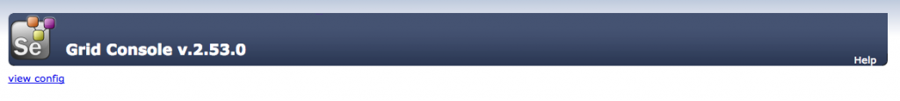
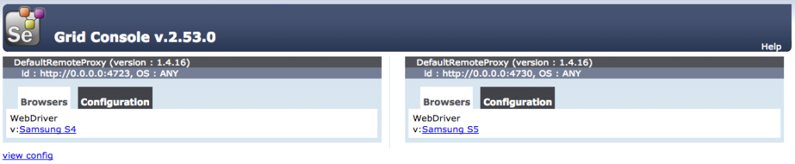

Often we wanted to perform mobile execution in parallel. The best way of performing the parallel execution is through selenium grid. I've faced few issues while setting up the grid for appium. I'll share my learnings about setting up the grid for appium mobile automation.

## Pre-requisites

- [Download selenium standalone server jar file](http://selenium-release.storage.googleapis.com/2.53/selenium-server-standalone-2.53.0.jar) - At the time of writing, the version of latest selenium is 2.53.
- [Appium](http://appium.io/) - The version that I was using is 1.4.16 and installed as Node npm package. I recommend to you also use npm package.
- Atleast two android devices for this experiment.

## Setup the selenium grid

Place the downloaded selenium standalone server jar in some directory. In my case I've placed in /Users/{username}/Tools/selenium.

Open your terminal and navigate to the directory to where you placed the jar file and execute the following command:

```bash
java -jar selenium-server-standalone-2.53.0.jar -role hub
```

This will start the selenium grid server in your local ip with the default port of **4444**. After you see this message **Selenium Grid hub is up and running**, open your browser and hit the following url: http://{your ip}:4444/grid/console and you should be able to see the following in your browser:



Congratulations!!! You started your grid successfully. Let's setup the nodes for our mobile devices.

## Setup the Appium nodes

I've two devices with me now, samsung S4 and samsung S5. I'm going to setup grid nodes for these two devices.

As per the documentation of appium [here](http://appium.io/slate/en/master/?ruby#selenium-grid), we need a node config json file to hook our appium node to our selenium grid hub. Let's prepare our 1st node config json and I'm calling that as **node_s4.json**:

```javascript
{
  "capabilities": [{
    "applicationName": "Samsung S4",
    "browserName": "Samsung S4",
    "platformName": "ANDROID",
    "maxInstances": 1
  }],
  "configuration": {
    "cleanUpCycle": 2000,
    "timeout": 30000,
    "proxy": "org.openqa.grid.selenium.proxy.DefaultRemoteProxy",
    "host": "127.0.0.1",
    "port": 4723,
    "maxSession": 1,
    "register": true,
    "registerCycle": 5000,
    "hubPort": 4444,
    "hubHost": "192.168.0.198"
  }
}
```

Here **applicationName** is mandatory since the grid identifies to which appium node the job should b e routed. Also, make sure you change the **hubHost** to your ip address.

Now let's start our appium node with this node config. In your terminal, start your appium like this:

```bash
appium --nodeconfig /Users/{username}/Tools/selenium/node_s4.json -p 4723 -bp 4724 -U {s4 device id}
```

This will start the appium server on the port 4723 and the bootstrap port 4724 (remember, the bootstrap port is mandatory for android devices) and with the device id of your device which you can get from **adb devices**.

Now refresh your grid console in your browser and you should see this:


Do the same for another device. In my case, the node json for samsung S5 device will look like:

```javascript
{
  "capabilities": [{
    "applicationName": "Samsung S5",
    "browserName": "Samsung S5",
    "platformName": "ANDROID",
    "maxInstances": 1
  }],
  "configuration": {
    "cleanUpCycle": 2000,
    "timeout": 30000,
    "proxy": "org.openqa.grid.selenium.proxy.DefaultRemoteProxy",
    "host": "127.0.0.1",
    "port": 4730,
    "maxSession": 1,
    "register": true,
    "registerCycle": 5000,
    "hubPort": 4444,
    "hubHost": "<<your ip>>"
  }
}
```

Changed the applicationName, browserName and port of appium node, and saved the file as **node_s5.json**. Now start your 2nd appium node in another terminal like this:

```bash
appium --nodeconfig /Users/{username}/Tools/selenium/node_s5.json -p 4730 -bp 4731 -U {s5 device id}
```

Refresh your browser and you should see this in your grid console page:



Voila!!! We have two appium nodes connected to our selenium hub.

In your test now, add the **applicationName** as part of your desired capabilities and point to the grid url instead of appium url. For example, my DesiredCapabilities and driver instantiation would look like:

```java
DesiredCapabilities capabilities = new DesiredCapabilities();
capabilities.setCapability("platformName", "Android");
capabilities.setCapability("deviceName", "Android");
capabilities.setCapability("applicationName", "Samsung S4");
capabilities.setCapability("app", "ApiDemos-debug.apk");
capabilities.setCapability("appPackage", "io.appium.android.apis");
capabilities.setCapability("appWaitActivity", "io.appium.android.apis.ApiDemos");
capabilities.setCapability("noReset", true);
driver = new AndroidDriver(new URL("http://<your ip>:4444/wd/hub/"), capabilities);
```

This will execute tests on Samsung S4 device.

## Mistakes done and Lessons learnt

1. **applicationName** - I spent more time on solving this issue. I was using **dataProvider** to execute tests in parallel. Even I was having 2 nodes setup, always grid was routing my tests to one node only. This was the haunting problem. Make sure you have this applicationName in your capabilities. The selenium default capability matcher explains about this. Follow this blog for more information: [Rationale Emotions](https://rationaleemotions.wordpress.com/2014/01/19/working-with-a-custom-capability-matcher-in-the-grid/).
2. **nodeconfig** - Even though you start your appium from the same directory where you placed the node config json files, you should provide the absolute path of the node config json for the parameter **\--nodeconfig** while starting your appium server.
3. **UDID** - Make sure you start your appium server with the **\-U** parameter with your device id in case you have more than one device. The reason is appium always selects the first device in your device list.

There will be a followup post on how I performed parallel execution using this grid setup. Coming Soon!!!
