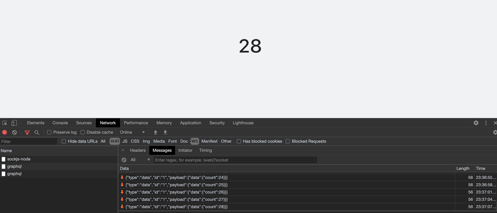
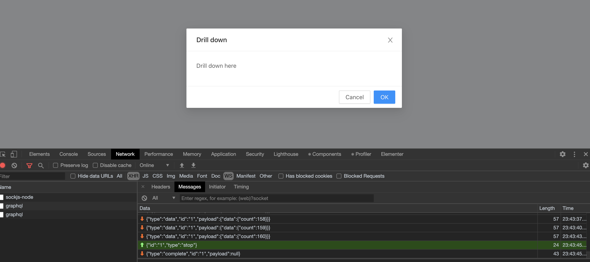

[GraphQL](https://graphql.org/) is one of my favourite topic to work with. At my [work](https://www.linkedin.com/in/vimalraj-selvam/), as a Site Reliability Engineer, I often work on Visualisation products and the backend is powered with GraphQL. When it comes to Visualisation, the real-time data is the user need and the GraphQL has something called **Subscription** which works on top of Web Sockets protocol.

A subscription is needed when you wanted to publish the data set to all the clients who subscribed / expressed their wish to receive updates. Here the client won't be polling for the data, rather server will be sending the data to all the subscribed clients whenever new data available.

## Problem Statement

We use GraphQL subscriptions for the real-time metrics data and show some graphs. When a user clicks on any graph panel, the modal will open up to perform slices and dices on the data. So the requirement is to cancel the subscription (aka. unsubscribe) when a user opens the modal. And re-subscribe when user closes the modal. Interesting, isn't it? Let's see how we can do this.

## Creating a GraphQL Subscription server

To demonstrate, I'm going to create a simple GraphQL Subscription server.

Currently I'm on a directory called, **graphql-subscription-demo**, and I'm going to create a new directory here and setup the required npm packages:

```bash
mkdir server
cd server
npm init -y
npm i -S graphql express apollo-server apollo-server-express
touch index.js
```

 And in `index.js` I'm going to create the following code snippet.

```jsx
const http = require('http')
const { ApolloServer, PubSub, gql } = require('apollo-server-express')
const express = require('express')

// Required constants
const COUNT_INCREMENTED = 'COUNT_INCREMENTED'
const PORT = 4000

// Express app instance
const app = express()

// Create pubsub instance
const pubsub = new PubSub()

// initiate counter
let count = 1

// Keep incrementing the counter for every 3 seconds
const interval = setInterval(() => {
  count += 1
	// Publish the incremented counter value
  pubsub.publish(COUNT_INCREMENTED, { count })
}, 3000)

const typeDefs = gql`
  type Query {
    """
    Get the current counter value
    """
    count: Int
  }

  type Subscription {
    """
    Publish the count value whenever it increments
    """
    count: Int
  }
`

// GraphQL Resolver
const resolvers = {
  Query: {
    count: () => count
  },

  Subscription: {
    count: {
      // This is where we listen to an event called COUNT_INCREMENTED and publish when an event triggered
      subscribe: () => pubsub.asyncIterator([COUNT_INCREMENTED])
    }
  }
}

// Create apollo server
const server = new ApolloServer({ typeDefs, resolvers })
server.applyMiddleware({ app })

const httpServer = http.createServer(app)
server.installSubscriptionHandlers(httpServer)

// Start the http and websocket server on our port
httpServer.listen(PORT, () => {
  console.log(`Server on http://localhost:${PORT}${server.graphqlPath}`)
  console.log(
    `Subscriptions on ws://localhost:${PORT}${server.subscriptionsPath}`
  )
})
```

In this snippet, I do the following things:

- Importing the required packages
- Defining constants:
    - **COUNT_INCREMENTED** - A string constant to use it as a identifier for our event
    - **PORT** - A port number where our server will run
- Creating an instance for the **express** app and the **PubSub** to manage our GraphQL subscriptions
- Initialising a counter variable with value as 1
- Incrementing the counter by 1 for every 3 seconds and also publishing the incremented value using our constant identifier
- Defined a GraphQL document with `Query` to get the current count value and `Subscription` to publish the count value whenever it is incremented
- Defined a GraphQL resolver
    - In `subscribe`, we listen to a variable called `COUNT_INCREMENTED` ****and publishes to subscribed clients if the payload changes
- Creating a Apollo server and HTTP server with required subscription handlers
- Starting the HTTP and Websocket server on the defined port

Once you have the above code in place, just run:

```bash
node index.js
```

This will start the server and you can access the GraphQL playground from: [http://localhost:4000/graphql](http://localhost:4000/graphql). You can play around with the query and subscription here before starting our real client.

## Creating a GraphQL Client application

I'm going to use React to create a GraphQL client application. To create a react app and install required packages (remember I was inside **server** directory),

```bash
cd ..
npx create-react-app client --use-npm
cd client
npm i -S graphql @apollo/client subscriptions-transport-ws
npm start
```

P.S: I'm using the recently announced Apollo Client @ 3.x version. Apart from the package name, the implementation holds same even for Apollo Client @ 2.x version.

Now straightaway go to `App.js` and remove everything. You follow me from this onwards:

First import the required packages:

```jsx
import React from 'react'
// I'm a big fan of Ant Design, but you can use any design system
import { Layout, Row, Col, Modal } from 'antd'
import {
  ApolloClient,
  InMemoryCache,
  ApolloProvider,
  gql,
  useQuery,
  HttpLink,
  split
} from '@apollo/client'
import { WebSocketLink } from '@apollo/client/link/ws'
import { getMainDefinition } from '@apollo/client/utilities'
```

Create a http link to  send our Query / Mutation using the HTTP Protocol:

```jsx
const httpLink = new HttpLink({
	// Server GraphQL endpoint
  uri: 'http://localhost:4000/graphql'
})
```

Next, create a Websocket link for our subscription handler:

```jsx
const subscriptionLink = new WebSocketLink({
	// Server GraphQL Subscription endpoint
  uri: 'ws://localhost:4000/graphql',
  options: {
		// Reconnect in case client disconnects and connects again
    reconnect: true
  }
})
```

Now merge both the links and create a Apollo client out of the merged link:

```jsx
const splitLink = split(
  ({ query }) => {
    const definition = getMainDefinition(query)
    return (
      definition.kind === 'OperationDefinition' &&
      definition.operation === 'subscription'
    )
  },
  subscriptionLink,
  httpLink
)

const client = new ApolloClient({
  link: splitLink,
  cache: new InMemoryCache() // In memory cache
})
```

Now we define our `Query` and `Subscription`:

```jsx
const COUNT_QUERY = gql`
  query CountQuery {
    count
  }
`

const COUNT_SUBSCRIPTION = gql`
  subscription CountSubscription {
    count
  }
`
```

Let's define our `App` functional component:

```jsx
function App() {
  return (
    <ApolloProvider client={client}>
      <Layout style={{ height: '100vh' }}>
        <Layout.Content
          style={{
            display: 'flex',
            flexDirection: 'column',
            justifyContent: 'center',
            alignItems: 'center'
          }}
        >
          <Row>
            <Col span={24} style={{ textAlign: 'center', padding: '16px 0' }}>
              <Counter />
            </Col>
          </Row>
        </Layout.Content>
      </Layout>
    </ApolloProvider>
  )
}

export default App
```

Here we're wrapping everything with `ApolloProvider` and initiating with the `client`. It is the React's context where any changes to the `client` object will re-render the child components. And also this is very much required, because we will be using the Apollo Client's hooks in the child components.

If you notice, we have a missing component `<Counter />`, let's define that. Create a function called `Counter` and put the following code:

```jsx
function Counter() {
  const { loading, error, data } = useQuery(COUNT_QUERY)
  const [modalVisible, setModalVisible] = React.useState(false)

  return (
    <>
      <h1
        style={{ fontSize: 54, cursor: 'pointer' }}
        onClick={() => setModalVisible(!modalVisible)}
      >
        {loading ? 'Loading' : error ? 'Error :(' : data.count}
      </h1>
      <Modal
        title="Drill down"
        visible={modalVisible}
        onOk={() => setModalVisible(false)}
        onCancel={() => setModalVisible(false)}
      >
        <p>Drill down here</p>
      </Modal>
    </>
  )
}
```

In this component, we trigger a GraphQL query `COUNT_QUERY` at the time of rendering this component and show the current count value using `data.count`. If user clicks on the count, it will open up the modal and show some dummy content.

Now head to your browser and see [http://localhost:3000](http://localhost:3000). If you notice, even though the count is incremented at the server side, the client is not updating. Reason is we haven't hooked up the subscription part yet. Let's do that now!

Add `subscribeToMore` field in the `useQuery` hook as follows. The reason I'm using `subscribeToMore` rather than `useSubscription` hook is because I want to show the current value once the user loads the page and doesn't really want to show the loading indicator for the 3 seconds when the subscription has not published the new value yet.

```jsx
const { loading, error, data, subscribeToMore } = useQuery(COUNT_QUERY)
```

Then define the `useEffect` to initiate the subscription during the component rendering. To know more about `useEffect`, read [this](https://overreacted.io/a-complete-guide-to-useeffect/).

```jsx
React.useEffect(() => {
  subscribeToMore({
    document: COUNT_SUBSCRIPTION,
    updateQuery: (prev, { subscriptionData }) => {
      if (!subscriptionData.data) return prev

      return {
        count: subscriptionData.data.count
      }
    }
  })
}, [subscribeToMore])
```

Here I'm calling a `subscribeToMore` method with the `COUNT_SUBSCRIPTION` graphQL document and client gets subscribed to the stream. Please note that I've added a `useEffect` dependence for `subscribeToMore` object.

Now look in your browser and you can see the count gets updated every 3 seconds whenever server increments. Voila! Our subscription works.

Small tip: Open Developer console, and head on to Network tab, select `WS` to see the websocket messages, you should see something like this:



So you can see that the payload is continuously sent to client by the server. Now we're going to see the real problem. Just click on the counter, and you see the modal and the subscription still receiving data. This is where we have to unsubscribe.

Let's modify our `useEffect` method little bit as follows:

```jsx
React.useEffect(() => {
  let unsubscribe
	
	// If modal is not visible, run the subscription and store the identifier in the `unsubscribe` variable
  if (!modalVisible) {
    unsubscribe = subscribeToMore({
      document: COUNT_SUBSCRIPTION,
      updateQuery: (prev, { subscriptionData }) => {
        if (!subscriptionData.data) return prev

        return {
          count: subscriptionData.data.count
        }
      }
    })
  }

	// Unsubscribe here
  if (unsubscribe) return () => unsubscribe()
}, [modalVisible, subscribeToMore])
```

So if you look at this we're subscribing to event when the modal is not visible and store that in a variable called `unsubscribe`. In the clean up method of `useEffect`, we just call the `unsubscribe` to cancel our graphql subscription. Also, remember to add `modalVisible` as another dependency to our hook. This does the magic. Let's head on to our browser to validate this.



In the browser, when the real time update is happening and your Developer console is opened, just click on the count value and let the modal open. And notice the messages and you see a `stop` type which means cancel the GraphQL subscription, the client won't be receiving any updates from the server until we close the modal.

The entire running code is available in Github:  [https://github.com/email2vimalraj/graphql-subscription-demo](https://github.com/email2vimalraj/graphql-subscription-demo) (If you have any questions, open up an issue here and also make sure you **star** the repo if you liked this article).

Last year I talked about Scaling GraphQL Subscriptions @ GraphQL Conf happened in Berlin (in case you're interested to watch): [https://youtu.be/k4rX8wUYjmU](https://youtu.be/k4rX8wUYjmU)

## References

[https://graphql.org/](https://graphql.org/)

[https://www.apollographql.com/docs/](https://www.apollographql.com/docs/)

[https://ant.design/docs/react/introduce](https://ant.design/docs/react/introduce)